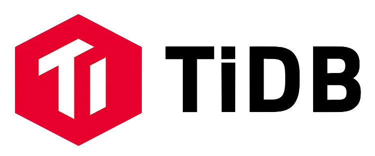

<div align="center" style="display: flex; align-items: center; justify-content: center; flex-wrap: wrap;">
  
  <span style="font-size: 28px; font-weight: bold; margin: 0 30px;">LAFAEK AI - TiDB FAH 2024</span>
  
</div>

---

# CLIP-TiDB Image Embeddings

This project demonstrates how to generate image embeddings using the CLIP model and store them in TiDB Serverless with Vector Search. This approach is part of our submission for the TiDB Future App Hackathon 2024 under the LAFAEK AI team.

## Table of Contents

- [Installation](#installation)
- [Usage](#usage)
- [Contributing](#contributing)
- [License](#license)
- [More Information](#more-information)

## Installation

### Step 1: Clone the Repository

Clone this GitHub repository to your local machine:

```bash
git clone https://github.com/ajitonelsonn/clip-tidb-image-embeddings.git
```

Navigate to the project directory:

```bash
cd clip-tidb-image-embeddings
```

### Step 2: Create a Virtual Environment

First, create a virtual environment to manage your dependencies:

```bash
python3 -m venv venv
```

Activate the virtual environment:

- On macOS/Linux:
  ```bash
  source venv/bin/activate
  ```
- On Windows:
  ```bash
  .\venv\Scripts\activate
  ```

### Step 3: Install Requirements

Install the required Python packages using `pip`:

```bash
pip install -r requirements.txt
```

This will install all the necessary libraries, including `torch`, `clip`, `mysql-connector-python`, `pandas`, and others required for running the Jupyter notebook.

## Usage

After setting up your environment and installing dependencies, you can start working with the notebook provided in the repository. The notebook walks you through the following:

1. Importing necessary libraries.
2. Loading the CLIP model for generating image embeddings.
3. Connecting to TiDB Serverless to store and retrieve embeddings.
4. Batch processing images and storing their embeddings in the database.
5. Performing vector searches to find similar images.

To run the notebook:

```bash
jupyter notebook
```

Open the `clip_tidb_image_embedings.ipynb` file in the Jupyter Notebook interface and follow the instructions provided.

## Contributing

We welcome contributions to this project. If you find a bug or have a feature request, please open an issue on GitHub. Feel free to fork the repository and submit a pull request.

## License

This project is licensed under the MIT License - see the [LICENSE](LICENSE) file for details.

## More About LAFAEK AI

1. **Lafaek AI - Motorbike Detection and Plate Recognition System**  
   This repository details a system designed to detect motorbikes and recognize license plates, storing images in AWS S3 and saving the paths to a MySQL database. The system captures and saves images from CCTV footage along with metadata like location coordinates, timestamps, and confidence levels.

   Each record contains information such as the location (`longitude`, `latitude`), image paths (`full_image_path`, `motorbike_image_path`, `plate_image_path`), plate number, and detection confidence. This structured data helps authorities quickly access and analyze the necessary information. Explore the repository here: [GitHub Link](https://github.com/ajitonelsonn/license_plate_recognition).

2. **How to Ingest Data from MySQL Local to TiDB Serverless Using Apache NiFi**  
   Learn how to efficiently ingest data from MySQL to TiDB Serverless using Apache NiFi. Read the detailed article on LinkedIn by the Lafaek AI team: [LinkedIn Article](https://www.linkedin.com/pulse/copy-how-ingest-data-from-mysql-local-tidb-serverless-ajito-hgvjc/?trackingId=U%2FB%2FAoQDSVuRBrE65cnEkw%3D%3D).

3. **Connecting Streamlit Apps to TiDB Server: A Step-by-Step Guide**  
   This guide explains how to connect your Streamlit apps to a TiDB server. Read the article on LinkedIn by the Lafaek AI team: [LinkedIn Article](https://www.linkedin.com/pulse/connecting-streamlit-apps-tidb-server-step-by-step-ajito-xsfzc/?trackingId=VAC9e6BERZy%2FHAoZYDy9hg%3D%3D).

4. **CLIP-TiDB Image Embeddings**  
   Discover how to generate image embeddings using the CLIP model and store them in TiDB Serverless with Vector Search. Read the article: [LinkedIn Article](https://www.linkedin.com/pulse/generate-image-embeddings-using-clip-storing-tidb-ajito-4ts4c/?trackingId=%2FPiYshS0QKiXKCBqXX8Ubg%3D%3D) and explore the repository: [GitHub Link](https://github.com/ajitonelsonn/clip-tidb-image-embeddings).

5. **Lafaek AI Application**  
   The Lafaek AI application is available for exploration. Visit the repository here: [GitHub Link](https://github.com/ajitonelsonn/TiDB_FAH_2024_Slafaekai) and try the demo here: [Streamlit Demo](https://lafaekaitidb.streamlit.app/).

6. **Lafaek AI Landing Page MVP**  
   The MVP landing page for Lafaek AI, created for the hackathon, is available. Visit the repository here: [GitHub Link](https://github.com/ajitonelsonn/TiDB_FAH_2024_Vlafaekai) and check out the demo here: [Vercel Demo](https://lafaekaitidb.vercel.app/index.html).

---

Happy coding! 🎉
**Made from 🇹🇱Timor-Leste with ❤️**
